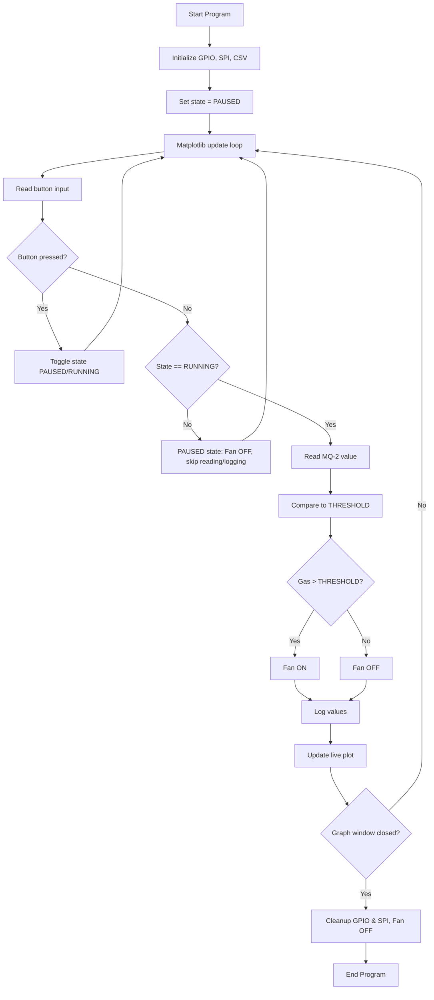

# Raspberry Pi Air Quality Monitor with Automatic Fan Control
ECEGR 2000 – Physical Computing with Python  
Student: Neha Dusi  

---

## 1. Project Overview

This project implements an air quality monitoring system using a Raspberry Pi, an MQ-2 gas sensor, and an MCP3008 analog-to-digital converter.

The system:
- Collects analog input data from the MQ-2 gas sensor.
- Converts the signal to digital using the MCP3008 ADC.
- Makes decisions based on a threshold value.
- Performs an action by turning a fan on/off through a MOSFET.
- Allows the user to start/stop data collection with a physical pushbutton.
- Displays a live Matplotlib graph of the sensor readings.
- Logs data to a CSV file for later review.

This fulfills the requirement of:  
**Collects input → Makes decision → Performs an action**

---

## 2. Build / Wiring

### 2.1 Components
- Raspberry Pi with GPIO header  
- MQ-2 gas sensor  
- MCP3008 ADC  
- 2N7000 N-channel MOSFET  
- 5V DC fan  
- Pushbutton  
- Resistors: 330–1kΩ  
- Breadboard and jumper wires  

### 2.2 Wiring Summary

MQ-2 → MCP3008
- MQ-2 VCC → 5V  
- MQ-2 GND → GND  
- MQ-2 AO → MCP3008 CH0  

MCP3008 → Raspberry Pi
- VDD → 3.3V  
- VREF → 3.3V  
- AGND → GND  
- DGND → GND  
- CLK → GPIO 11  
- DOUT → GPIO 9  
- DIN → GPIO 10  
- CS → GPIO 8  

Fan + MOSFET
- Fan red → 5V  
- Fan black → MOSFET Drain  
- MOSFET Source → GND  
- MOSFET Gate → resistor (330Ω) → GPIO 18  

Button
- One side → GPIO 23  
- Other side → GND  
- Pull-up enabled in software  

All grounds must be tied together.

---

## 3. Code Installation / Example

### 3.1 Enable SPI

Interface Options → SPI → Enable → Reboot.

### 3.2 Install required libraries
sudo apt update
sudo apt install -y python3-rpi.gpio python3-spidev python3-matplotlib

### 3.3 Running the program
Reset log file:
python3 clear_data.py

Start the system:
1. Hit the RUN button on Thonny!
2. Press the button on the bread board to start and stop
3. Use the cleenex, or clorox wipe to cover the sensor and watch the graph change, and the fan turn on
4. Press the button again to pause, or exit the graph to stop!

OR

python3 air_quality_live.py

Behavior:
- System starts in PAUSED mode.
- Press button (GPIO 23) to toggle RUNNING mode.
- Fan turns ON when gas > THRESHOLD, otherwise OFF.
- Data is logged in air_quality_log.csv.
- Close graph window to exit and cleanup.

---

## 4. Flow Chart

Below is the system's flow chart:

This flow chart matches the logic in `air_quality_live.py`.

---

## 5. Threshold Selection

Typical values for MQ-2 after warm-up:

- Clean air: ~50–100  
- Dirty air: ~400–600  

Set in code:

THRESHOLD = 300

---

## 6. Possible Extensions

- Add temperature, humidity, or CO2 sensors
- OLED display showing live values
- Remote data dashboard (Flask web server)
- SMS/email alerts
- Long-term data analysis

---

## 7. Credits

Project created for ECEGR 2000 – Physical Computing with Python at Seattle University.  
All wiring, code, testing, and documentation by Neha Dusi.

Outside help using: 
Reddit for project inspiration
Core electronics YouTube video PiicoDev Air Quality Sensor video
MQ-2 gas sensor datasheet
MCP3008 datasheet
Raspberry Pi GPIO documentation
Python spidev library
Python matplotlib documentation

# air_quality_project
